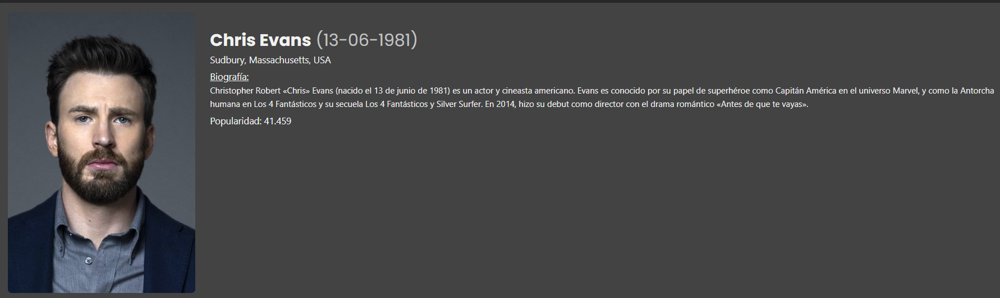

La página de detalle del actor es una parte integral de nuestro sitio web que proporciona una visión en profundidad de la vida y la carrera de un actor. Esta página está diseñada para ofrecer a los usuarios una experiencia informativa y atractiva.

Al abrir la página de detalle del actor, los usuarios son recibidos con una imagen destacada del actor a la izquierda. Esta imagen no solo añade un elemento visual atractivo a la página, sino que también ayuda a los usuarios a identificar y familiarizarse con el actor.

A la derecha de la imagen, los usuarios pueden encontrar información detallada sobre el actor. Esta sección incluye el nombre del actor, su lugar de nacimiento, una biografía y su nivel de popularidad. Esta información detallada permite a los usuarios obtener un conocimiento más profundo sobre el actor.

Más abajo en la página, se exhiben las películas y las series de televisión en las que el actor ha participado. Esta sección ofrece a los usuarios una visión de la carrera del actor, permitiéndoles descubrir nuevas películas o series de televisión en las que el actor ha trabajado.

Además, cada película y serie de televisión mostrada en la página de detalle del actor es interactiva. Al hacer clic en una película o serie de televisión, los usuarios son redirigidos a una página de detalle de la [película](detallePeli.md) o [serie](detalleSerie.md) . 

