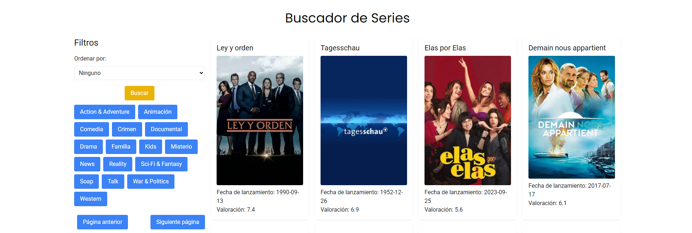

# Buscador de Series

En esta segunda sección de la barra de navegación podremos encontrar un buscador de series, el cual nos permitirá buscar series, filtrarlas por género y ordenarlas por fecha de lanzamiento o por valoración, entre otras opciones.

También existe una paginación que nos permitirá navegar entre todos los resultados de búsqueda y no estar limitados solo a la primera página resultante.



## Implementación de Búsqueda y Visualización de Series

Este código implementa una funcionalidad de búsqueda y visualización de series en un proyecto web. Aquí se detallan las partes clave del código:

#### Importación de Módulos y Configuración de Variables

Se importan los módulos navbar y toTop. Además, se configuran variables esenciales, como la clave de la API (apiKey), la URL base de la API (apiBaseUrl), y otras variables relacionadas con la paginación y la gestión de géneros.

```javascript title="buscarSeries.js"
import { navbar } from "./navbar";
import { toTop } from "./toTop";

const apiKey = "a35eb9b2a0da4da2cd02766b7d42ed24";
const apiBaseUrl = "https://api.themoviedb.org/3";
let currentPage = 1;
let series = [];
let selectedGenre = null;
const genres = {};
```

#### Función de Búsqueda de Series
Esta función realiza una solicitud a la API de The Movie Database (TMDb) para obtener series según los criterios especificados, como la página actual, el rango de fechas y el género seleccionado. Luego, se procesa la respuesta y se llama a la función renderMovies para mostrar los resultados en el DOM.

```javascript title="buscarSeries.js"
function searchSeries() {
  const sortBy = document.getElementById("sort_by").value;
  let url = `${apiBaseUrl}/discover/tv?api_key=${apiKey}&language=es-ES&page=${currentPage}&primary_release_date.gte=1980-01-01&primary_release_date.lte=2024-12-31`;
  if (selectedGenre) {
    url += `&with_genres=${selectedGenre}`;
  }
  if (sortBy) {
    url += `&sort_by=${sortBy}`;
  }

  fetch(url)
    .then(response => response.json())
    .then(data => {
      series = data.results;
      renderSeries();
    })
    .catch(error => {
      console.error(error);
    });
}

```

#### Función de Renderizado de Series
La función renderMovies se encarga de generar y mostrar elementos HTML para cada serie en la interfaz. Se crea un enlace (***< a >***) para cada serie con detalles como título, imagen de póster, fecha de lanzamiento y valoración.
```javascript title="buscarSeries.js"
function renderMovies() {
  const resultsDiv = document.getElementById("results");
  resultsDiv.innerHTML = "";

  for (const movie of movies) {
    if (movie.poster_path && movie.release_date) {
      const movieLink = document.createElement("a");
      movieLink.href = `detallePelicula.html?id=${movie.id}`;
      movieLink.classList.add("bg-white", "p-4", "rounded", "shadow");
      movieLink.innerHTML = `
              <h2 class="mb-2 text-xl">${movie.title}</h2>
              
              <p>Fecha de lanzamiento: ${movie.release_date}</p>
              <p>Valoración: ${movie.vote_average}</p>
          `;
      resultsDiv.appendChild(movieLink);
    }
  }
}
```

#### Funciones de Paginación y Selección de Género
Estas funciones gestionan la paginación y la selección de género. nextPage y previousPage avanzan y retroceden a través de las páginas de resultados, mientras que selectGenre filtra los resultados por el género seleccionado.
```javascript title="buscarSeries.js"
function nextPage() {
  currentPage++;
  searchMovies();
}

function previousPage() {
  if (currentPage > 1) {
    currentPage--;
    searchMovies();
}

function selectGenre(genreId) {
  selectedGenre = genreId;
  searchMovies();
}
```

#### Carga de Géneros
La función loadGenres obtiene y muestra los géneros disponibles. Cada género se representa como un botón interactivo que, al hacer clic, filtra los resultados de búsqueda.
```javascript title="buscarSeries.js"
function loadGenres() {
  const url = `${apiBaseUrl}/genre/movie/list?api_key=${apiKey}&language=es-ES`;

  fetch(url)
    .then(response => response.json())
    .then(data => {
      const genresDiv = document.getElementById("genres");
      genresDiv.innerHTML = "";

      for (const genre of data.genres) {
        genres[genre.id] = genre.name;
        const button = document.createElement("button");
        button.classList.add("px-4", "py-2", "bg-blue-500", "text-white", "rounded", "mr-2", "mb-2");
        button.textContent = genre.name;
        button.onclick = () => selectGenre(genre.id);
        genresDiv.appendChild(button);
      }
    })
```

<span style="color:red; font-size:25px">¡Importante!</span>

Estas líneas aseguran que ciertas funciones estén disponibles globalmente en el objeto window, lo que permite su acceso desde otros scripts o entornos.

Sin esto no funcionaría nada.
```javascript title="buscarSeries.js"
// Agrega las funciones al objeto window
window.searchMovies = searchMovies;
window.previousPage = previousPage;
window.nextPage = nextPage;
```
