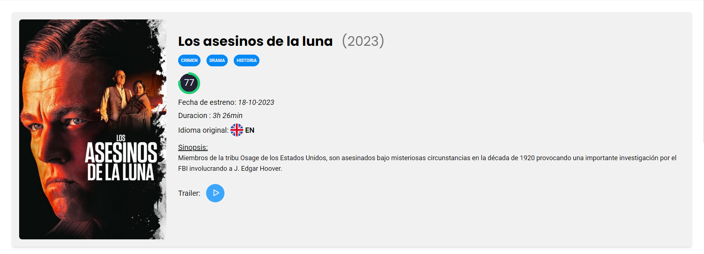
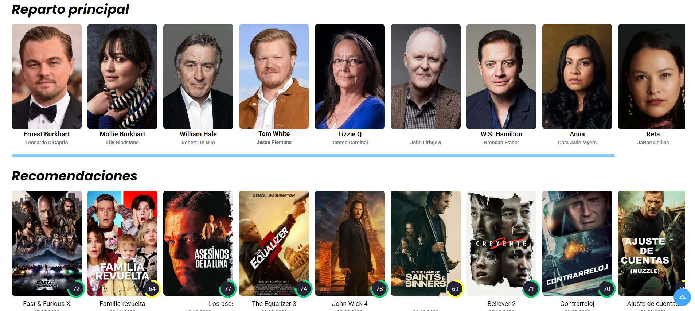

# Detalle de la Película

La página de detalle de la película muestra información detallada sobre una película específica. Se mostrarán los datos de la película, como el título, la imagen del póster, la fecha de lanzamiento, la valoración, la sinopsis y el género. También se mostrará el reparto de la película y una lista de películas similares recomendadas en base a los géneros de la seleccionada.




## Funcionamiento

Para ello, se realiza una petición a la API de The Movie Database (TMDb) con la URL de detalles de la película. Luego, se procesa la respuesta y se llama a la función renderMovie para mostrar los resultados en el DOM.

```javascript title="mainDetallePeli.js"
import { verDetalle } from "./verDetallePelicula.js";
import { verReparto } from "./verReparto.js";
import { CAST_API_URL, MOVIE_API_URL } from "./config.js";
import { toTop } from "./toTop.js";
import { navbar } from "./navbar.js";

verDetalle(MOVIE_API_URL);
verReparto(CAST_API_URL, "castList");
```

En el js de `verDetallePelicula,js` se modifican los datos de la película a nuestro gusto para así poder mostrar los datos que queremos con nuestros propios estilos. También mostramos los 10 primeros actores/actrices de la película mediante la función `verReparto.js`.

```javascript title="verDetallePelicula.js"
import { IMAGE_URL, API_KEY } from "./config.js";
import { verTrailer } from "./verTrailer.js";
import { mostrarModal } from "./mostrarModal.js";
import { printMovies } from "./printMovie.js";
import * as utilities from "./utilities.js";

let movieTitle;

export function verDetalle(MOVIE_API_URL) {
  fetch(MOVIE_API_URL)
    .then((response) => response.json())
    .then((movie) => {
        // Modificamos los datos de la película a nuestro gusto
        
        // Mostramos el póster de la película
        document.getElementById("movieImage").addEventListener("click", () => mostrarModal(imageUrl));

        // Botón para ver el trailer de la película
        document.getElementById("trailerButton").addEventListener("click", () => verTrailer(movieTitle));
    })
    .catch((error) => {
      console.error(error);
    });
}
```

Usaremos la función [`mostrarModal.js`](funciones.md/#mostrarmodal) para mostrar el póster de la película en un modal y la función [`verTrailer.js`](funciones.md/#vertrailer) para mostrar el trailer de la película en un modal.


En el js de `verReparto.js` se muestran los 10 primeros actores/actrices de la película.
