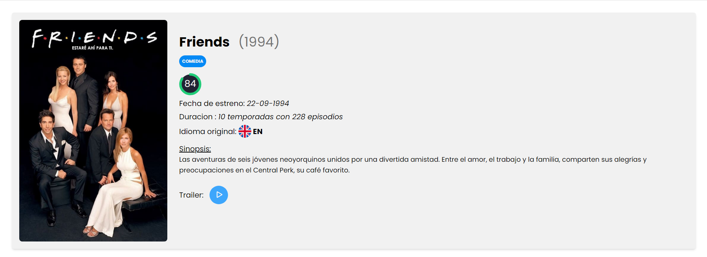
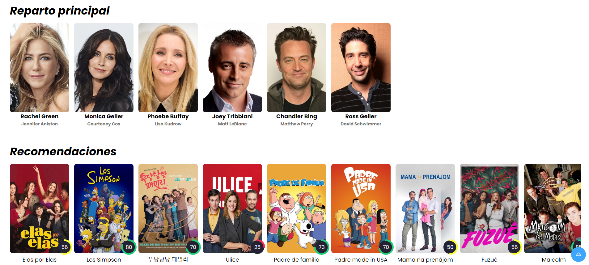

# Detalle de la Serie

La página de detalle de la serie muestra información detallada sobre una serie específica. Se mostrarán los datos de la serie, como el título, la imagen del póster, la fecha de la primera emisión, la valoración, la sinopsis y el género. También se mostrará el reparto de la serie y una lista de series similares recomendadas en base a los géneros de la seleccionada.




## Funcionamiento

Para ello, se realiza una petición a la API de The Movie Database (TMDb) con la URL de detalles de la serie. Luego, se procesa la respuesta y se llama a la función renderMovie para mostrar los resultados en el DOM.

```javascript title="mainDetalleSerie.js"
import { verDetalle } from "./verDetalleSerie.js";
import { verReparto } from "./verReparto.js";
import { SERIE_API_URL, TV_CAST_API_URL } from "./config.js";
import { toTop } from "./toTop.js";
import { navbar } from "./navbar.js";

verDetalle(SERIE_API_URL);
// Para series de televisión
verReparto(TV_CAST_API_URL, "castList");
```

En el js de `verDetalleSerie,js` se modifican los datos de la serie a nuestro gusto para así poder mostrar los datos que queremos con nuestros propios estilos. También mostramos los 10 primeros actores/actrices de la serie mediante la función `verReparto.js`.

```javascript title="verDetalleSerie.js"
import { IMAGE_URL, API_KEY } from "./config.js";
import { verTrailer } from "./verTrailer.js";
import { mostrarModal } from "./mostrarModal.js";
import { printMovies } from "./printMovie.js";
import * as utilities from "./utilities.js";

let serieTitle;

export function verDetalle(MOVIE_API_URL) {
  fetch(MOVIE_API_URL)
    .then((response) => response.json())
    .then((movie) => {
        // Modificamos los datos de la serie a nuestro gusto
        
        // Mostramos el póster de la serie
        document.getElementById("movieImage").addEventListener("click", () => mostrarModal(imageUrl));

        // Botón para ver el trailer de la serie
        document.getElementById("trailerButton").addEventListener("click", () => verTrailer(movieTitle));
    })
    .catch((error) => {
      console.error(error);
    });
}
```

Usaremos la función [`mostrarModal.js`](funciones.md/#mostrarmodal) para mostrar el póster de la serie en un modal y la función [`verTrailer.js`](funciones.md/#vertrailer) para mostrar el trailer de la serie en un modal.


En el js de `verReparto.js` se muestran los 10 primeros actores/actrices de la serie.
