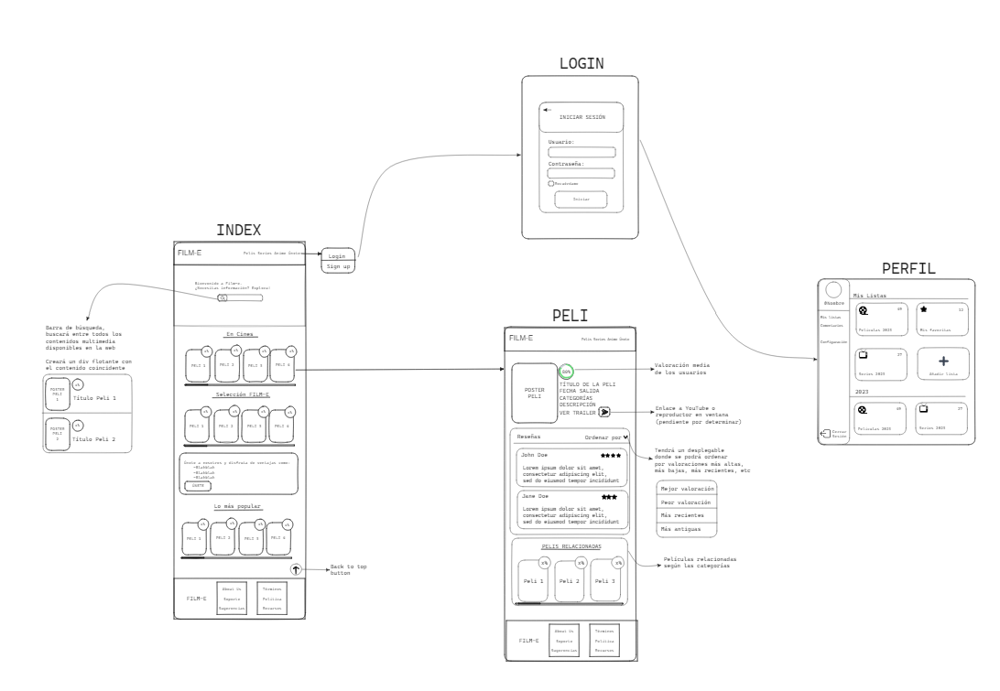

# Excalidraw

## ¿Qué es Excalidraw?

***Excalidraw*** es una herramienta de pizarra virtual colaborativa que te permite dibujar fácilmente diagramas con un aspecto de dibujo a mano. Es absolutamente gratuita y produce resultados que son limpios y atractivos.

## ¿Para qué sirve Excalidraw?

Excalidraw es especialmente útil para crear diagramas técnicos, bocetos y otros tipos de ilustraciones que requieren un aspecto de dibujo a mano. Los diagramas creados con Excalidraw tienen un aspecto único y atractivo que puede hacer que tus presentaciones o documentación se destaquen.

Además de su aspecto de dibujo a mano, Excalidraw también es **colaborativo**, lo que significa que puedes trabajar en un diagrama con otras personas en tiempo real. Esto puede ser muy útil para el trabajo en equipo o para situaciones en las que necesitas obtener retroalimentación sobre tu trabajo.

Excalidraw también es **seguro**. Aunque es una herramienta en línea, todos los datos que creas con Excalidraw se almacenan localmente en tu dispositivo, y no se envían a ningún servidor. Esto significa que puedes usar Excalidraw para dibujar diagramas sensibles sin tener que preocuparte por la privacidad de tus datos.

## Diseño inicial en Excalidraw

El diseño que hemos creado en Excalidraw representa una versión inicial de lo que imaginamos para nuestro proyecto. Es un boceto que captura nuestras ideas iniciales y proporciona una representación visual de cómo podrían organizarse y presentarse los elementos en nuestro sitio web o aplicación.

Este primer diseño es una herramienta valiosa para la planificación y la comunicación. Nos permite visualizar nuestras ideas y compartirlas con otros. También puede servir como punto de partida para discusiones y colaboraciones con miembros del equipo, partes interesadas o clientes.

Además, este diseño inicial puede evolucionar a medida que nuestro proyecto avanza. Podemos iterar sobre él, haciendo ajustes y refinamientos basados en los comentarios, las pruebas de usuario, o los cambios en los requisitos del proyecto.

## Nuestro Excalidraw inicial

A continuación, mostraremos el diseño inicial que hemos creado para nuestro proyecto. Algunas de las ideas no se han podido realizar debido a falta de tiempo y otras muchas que hemos agregado no formaban parte del diseño inicial.

