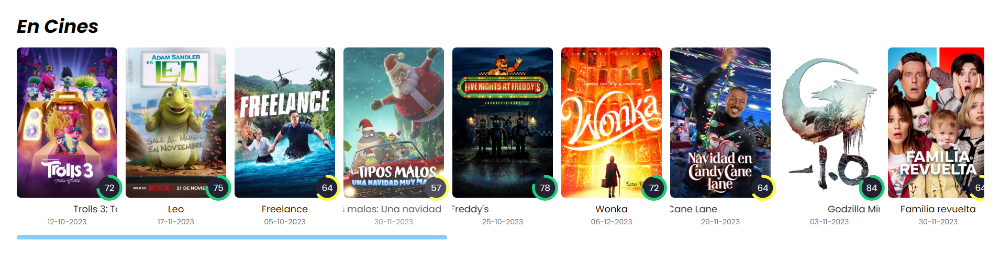

# Index de Fim-E

La página de inicio de Film-E se organiza en varias secciones, ofreciendo una experiencia completa para los amantes del cine y las series.

A continuación, se describe cada una de las secciones del index de Film-E con su link a la página correspondiente del detalle.

## Barra de navegación (Navbar)

En la cima, la barra de navegación presenta el logo de Film-E y enlaces directos a las diversas páginas del sitio web, junto con el botón de cambio a [modo oscuro](modoOscuro.md).

## Buscador de películas y series

Justo debajo de la barra de navegación, te da la bienvenida un buscador de películas y series en un diseño tipo "hero". Este elemento central ocupa gran parte de la pantalla, asegurando que los usuarios encuentren fácilmente lo que buscan.

## Películas en Cines

Descendiendo desde el buscador, descubrirás la sección de películas en que se encuentran actualmente en cines. El usuario podrá ver el título, la fecha de estreno y la valoración de la película. Si el usuario desea ver más detalles de la película, puede hacer click encima de la tarjeta de la película y será redirigido a la página de detalles de la película.

## Selección de Film-E

Más abajo, podremos encontrar una función (no desarrollada aún) que permite a los usuarios ver una selección de películas y series recomendadas por Film-E. Dicho apartado se realizaría mediante la creación de un json con el contenido que querríamos mostrar imitando la respuesta de la API.

## Únete a Film-E

Bajando más, encuentras la sección de únete a Film-E, donde podrás encontrar tres opciones para unirte a la comunidad de Film-E. Estos planes te permitirán acceder a funciones exclusivas dentro de la web (ficticias, ya que no se ha desarrollado la funcionalidad de pago ni de login).ç

## Películas populares

Más abajo, la sección de películas populares destaca una cuidadosa selección de películas aclamadas por la comunidad.

## Pie de página (Footer)

Finalizando la página, el pie de página presenta nuevamente el logo de Film-E y enlaces a información adicional, como "About Us", términos de servicio, política de privacidad y recursos utilizados.

