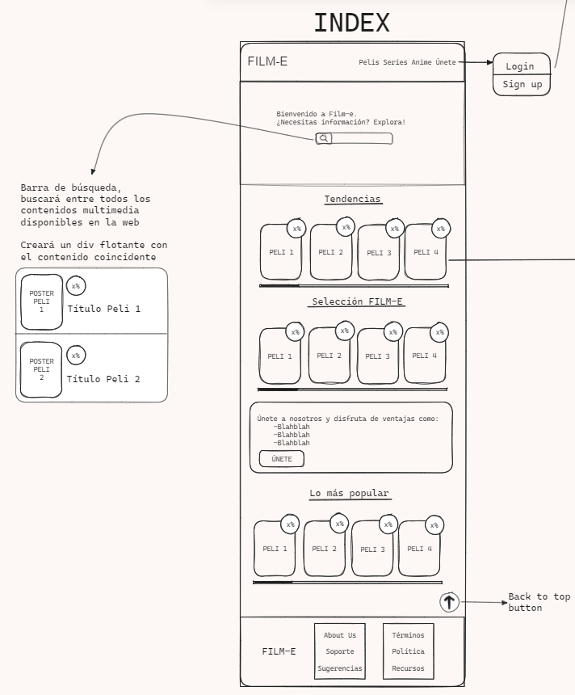

# Index de Fim-E

La página de inicio de Film-E se organiza en varias secciones, ofreciendo una experiencia completa para los amantes del cine y las series.

## Barra de navegación (Navbar)

En la cima, la barra de navegación presenta el distintivo logo de Film-E y enlaces directos a las diversas páginas del sitio web.

## Buscador de películas y series 

Justo debajo de la barra de navegación, te da la bienvenida un buscador de películas y series en un diseño tipo "hero". Este elemento central ocupa gran parte de la pantalla, asegurando que los usuarios encuentren fácilmente lo que buscan.

## Películas en tendencia

Descendiendo desde el buscador, descubrirás la sección de películas en tendencia. Aquí, una selección actualizada de películas de moda permite a los usuarios explorar horizontalmente y mantenerse al día con las últimas tendencias cinematográficas.

## Selección del usuario

A continuación, la sección de películas seleccionadas por el usuario brinda un espacio personalizado para guardar y acceder rápidamente a las películas favoritas de cada usuario.

## Suscripciones

Bajando más, encuentras la sección de suscripciones, donde los usuarios pueden unirse a diferentes métodos de pago para acceder a contenido exclusivo de Film-E.

## Películas populares

Más abajo, la sección de películas populares destaca una cuidadosa selección de películas aclamadas por la comunidad de Film-E.

## Pie de página (Footer)

Finalizando la página, el pie de página presenta nuevamente el logo de Film-E y enlaces a información adicional, como "About Us", términos de servicio, política de privacidad y recursos.

¡Explora el mundo cinematográfico con Film-E!

[Diseño detallado de película Film-E](paginaDetalles.md)
