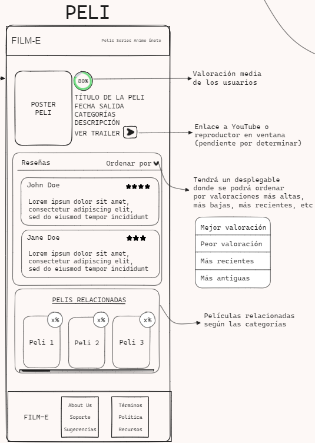

# Detalles Cinematográficos en Film-E 🎥

## Barra de navegación (Navbar)

La experiencia comienza con familiaridad. La barra de navegación, con el inconfundible logo de Film-E, guía tu travesía por la página de detalles de la película, ofreciendo accesos rápidos a otras secciones del sitio.

## Información de la película 🎬

Justo debajo, adéntrate en el corazón de la película. A la izquierda, el póster te da la primera impresión visual, mientras que a la derecha, se despliega una rica sinfonía de datos: título, sinopsis, reparto y más. Un botón estratégico invita a sumergirte en el tráiler, anticipando la experiencia cinematográfica.

## Reseñas 📝

Descendiendo por la narrativa digital, encuentras la sección de reseñas. Aquí, las opiniones se entrelazan, proporcionando un compendio de perspectivas. Lee lo que otros cinéfilos han expresado y comparte tus propias impresiones. La película cobra vida a través de los ojos de la comunidad Film-E.

## Películas relacionadas 🌐

La historia se expande hacia nuevas posibilidades en la sección de películas relacionadas. Descubre gemas afines al género de la película que te cautivó, ofreciendo un viaje continuo a través de historias cinematográficas.

## Pie de página (Footer) 🦶

Como epílogo de esta odisea cinematográfica, el pie de página emerge con el logo de Film-E, anclando la experiencia y proporcionando enlaces a información adicional. Desde "About Us" hasta los términos de servicio, la política de privacidad y recursos, cada enlace te invita a profundizar en el mundo de Film-E.

¡Sumérgete en la magia del cine con Film-E! 🍿

